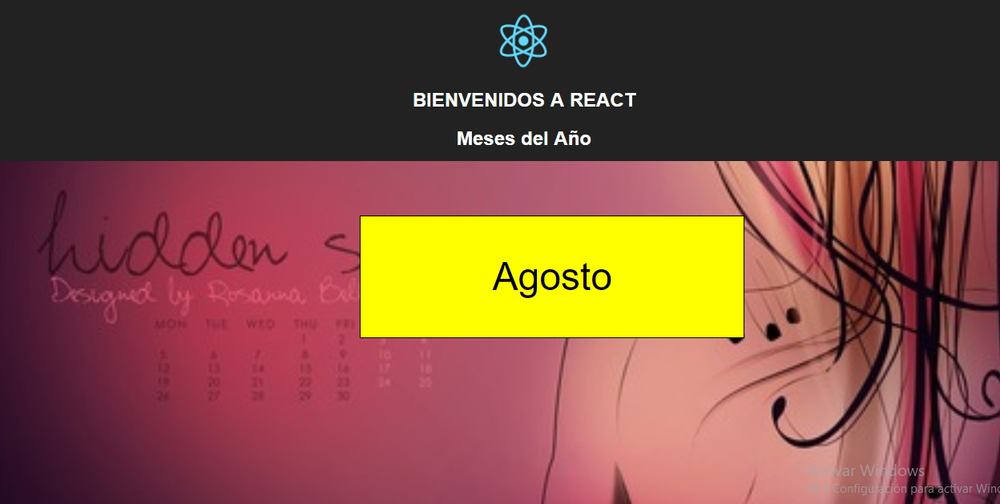
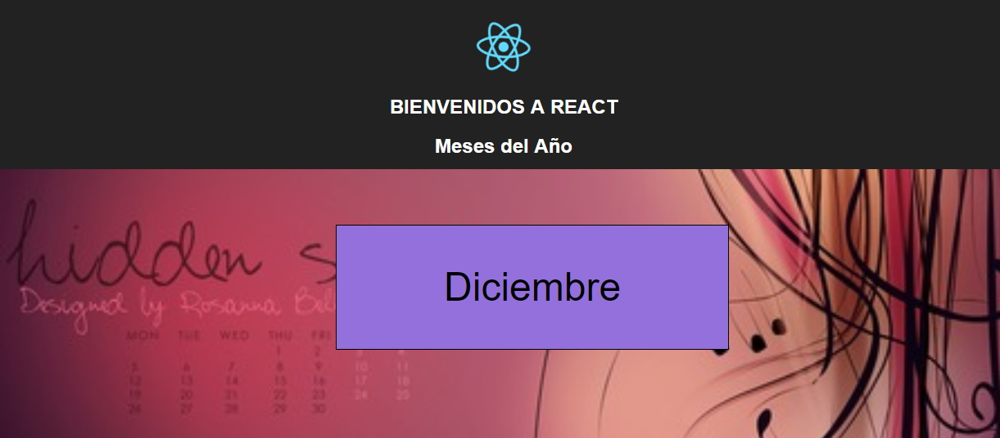
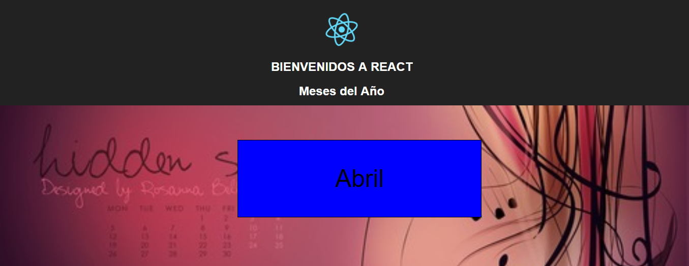
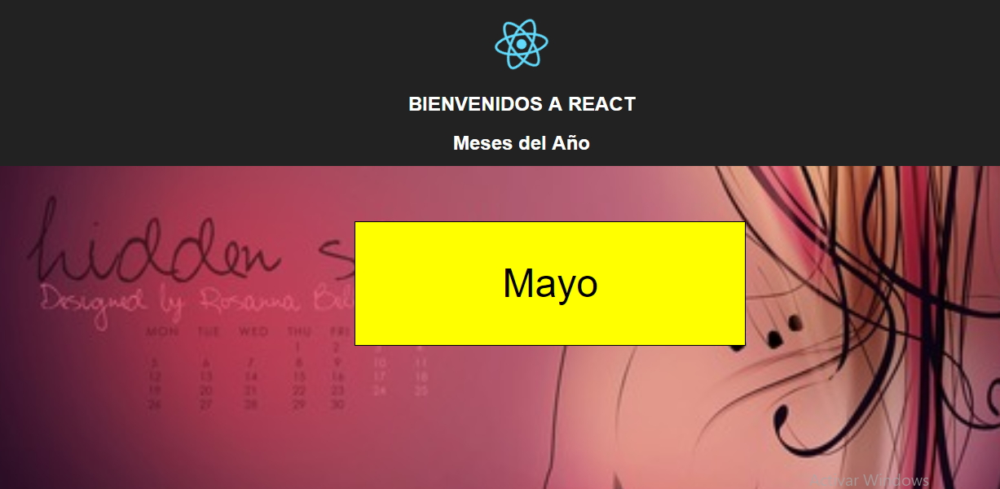

# Random 
## Objetivo
Crear a través de la librería React una plataforma que muestre al azar los mese del año y ala vez cambie el color del fondo cuando se recarge.

## Herramientas
 * React
 * Creacte
 

## Flujo
1. Se crea en el html el div donde se creara la colores y los meses.
 ```html
   <div id="root"></div>
 ```

2. Para obtner las palabras se implementa la función random para generar los meses de manera aleatoria ` Math.random()`.

 Ejemplo:

 ```javascript
    const words = ["Enero", "Febrero", "Marzo", "Abril", "Mayo", "Junio", "Julio", "Agosto", "Setiembre", "Octubre", "Noviembre", "Diciembre"]
    let wordsRandom = words[Math.round(Math.random() * words.length)];
 ```
3. Para obtner el color se implementa la función random para generar los meses de manera aleatoria ` Math.random()`.

 Ejemplo:

 ```javascript
    cconst color = ["red", "blue", "yellow", "green", "orange", "blueviolet", "lawngreen", "mediumpurple", "palevioletred", "palegoldenrod","aqua","pink"]
    let colorRandom = color[Math.round(Math.random() * color.length)];
    console.log(colorRandom);
 ```
4. Luego creamos una variable donde almacenaremos los estilos para llamar por medio de style.

 Ejemplo:

 ```javascript
  let liStyle = { background: colorRandom };
 ```
5. Acontinuacion crearemos de manera dinamica los elementos del html y colocaremos llamaremos a las palabras y colores para que se genere de manera aleatoria.
 Ejemplo:

 ```javascript
  return (
      <div className="App main-css">
        <header className="App-header">
          
          <h1 className="App-title">BIENVENIDOS A REACT</h1>
          <h2 >Meses del Año</h2>          
        </header>
        <div >
          <div className="Random-cards" style={liStyle}>
            <p>{wordsRandom}</p>
          </div>
        </div>
      </div>
      
    );
```

## Resultado
1. Primer resultado

   

2. Segundo resultado: Al recargar la página el resultado es

   

3. Tercer Resultado

   
3. Cuarto Resultado

   
